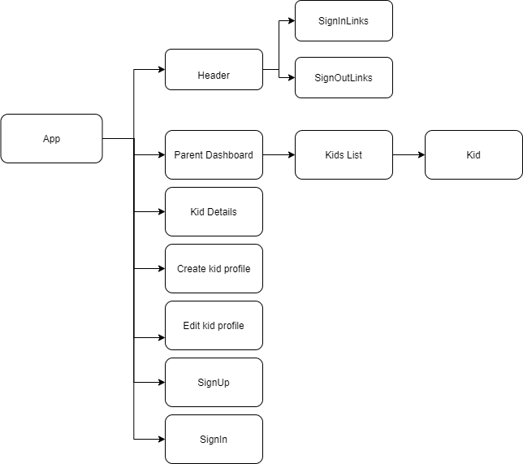
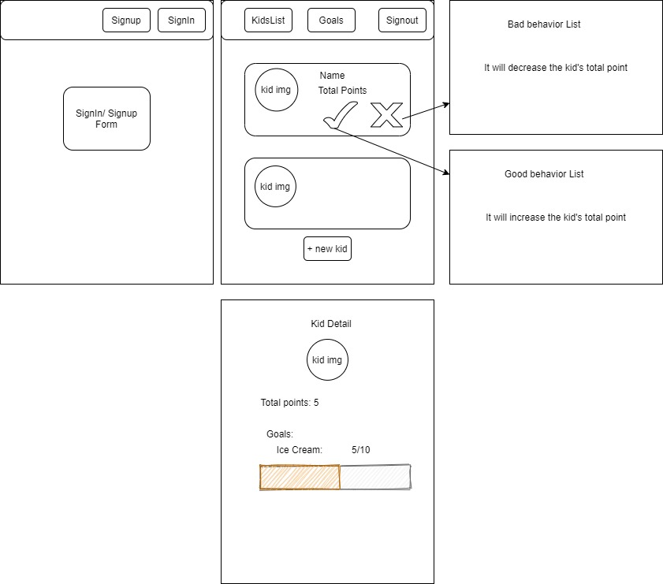

# _Chiltrack_

#### _A React Redux application for parents to track thir kids' daily progress._ 

#### _September 25, 2020 | Fatma C. Dogan_

## Description

_An application for parents who can track their kids’ behavior, daily progress, and set a goal(reward) to motivate them_


### Component Diagram



## Specification user stories:

## Wireframes



##### Minimum Viable Product

* User(parent) registration (database storage)
* User sign in and sign out (database authentication)
* Capability create a child profile
* Capability update(manage) child profile
* Capability create reward
* Capability see set rewards
* Capability update rewards
* Capability delete selected reward
* Capability increase total behavior points
* Capability decrease total behavior points
* Capability see total behavior points
* Capability to set up multiple children to their account


## Setup/Installation Requirements

#### Node install

###### For macOS:
_If Homebrew is not installed on your computer already, then install Homebrew by entering the following two commands in Terminal:_
* $ /usr/bin/ruby -e "$(curl -fsSL https://raw.githubusercontent.com/Homebrew/install/master/install)"
* $ echo 'export PATH=/usr/local/bin:$PATH' >> ~/.bash_profile

_Install Git with the following command:_
* $ brew install git

_Next, install Node.js by entering the following command in Terminal:_
* $ brew install node

###### For Windows:
_Please visit the [Node.js website](https://nodejs.org/en/download/) for installation instructions._

#### Install this application

_Clone this repository via Terminal using the following commands:_
```
cd desktop
git clone https://github.com/fc-dogan/ChilTrack
cd ChilTrack
```

_Next, install npm at the project's root directory, and start the server:_
```
npm install
npm start
```

_If everything is correct, the localhost site should open automatically_

_View the contents of this project by opening in VSCode:_
```
code .
```


## Technologies Used

* _React_
* _Redux_
* _Jest_
* _JavaScript_
* _WebPack_
* _CSS_
* _Git_

### License

*This webpage is licensed under the MIT license.*

Copyright &copy; 2020 **_Fatma C. Dogan_**