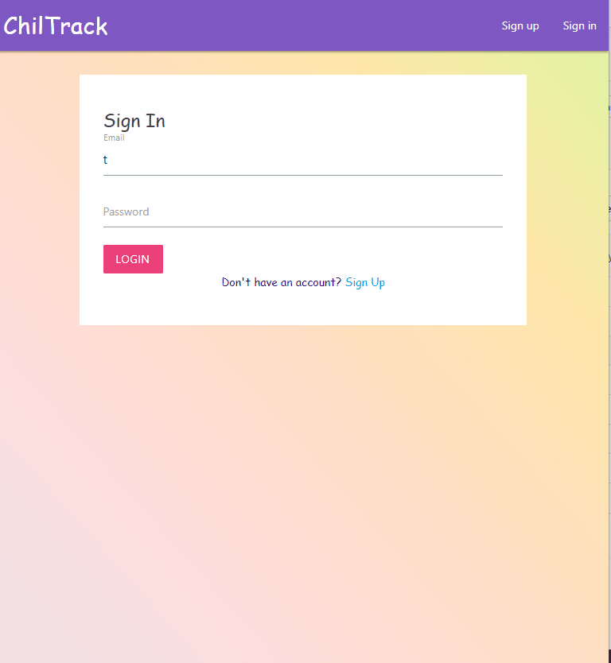
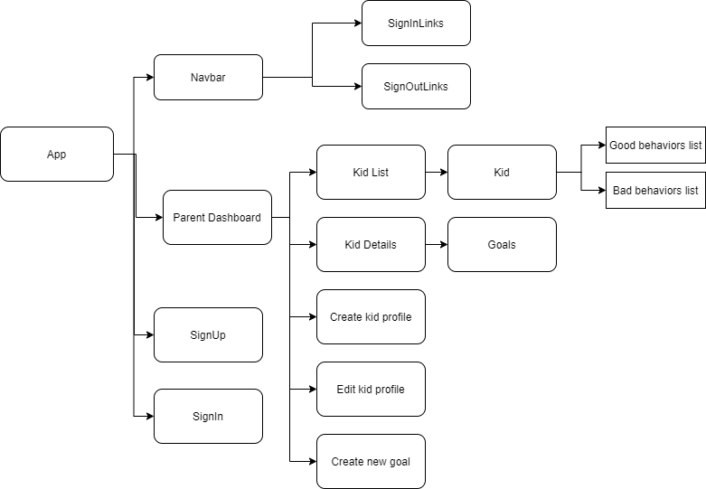
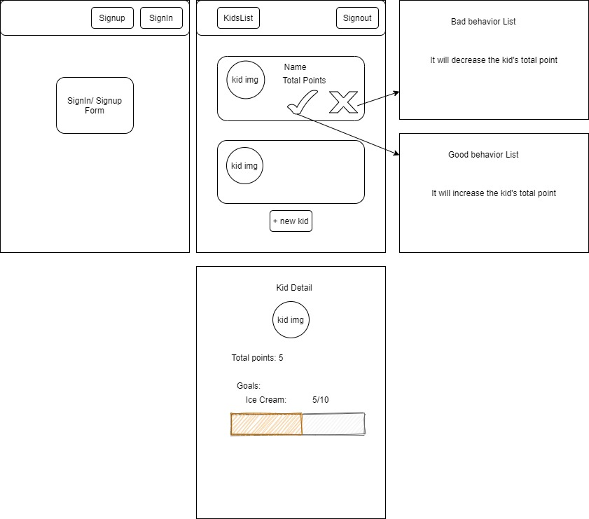

# _Chiltrack_

#### _A React Redux application for parents to track thir kids' daily progress._ 

#### _October, 2020 | Fatma C. Dogan_

## Description

_An application for parents who can track their kids’ behavior, daily progress, and set a goal(reward) to motivate them_

<details>
<summary><strong> Use Case</strong> </summary>

Users are parents who are struggling to motivate kids for good behavior. Especially parents who have multiple children track their behavior is very challenging. With this application, They can set up multiple children to their account, track the behaviors individually, and can provide specific goals for each of them.
This application will be a fun-based behavioral tracker, designed to encourage desired behaviors in children. The purpose of the application is to get the kids involved by setting their goals with parents to get them a sense of achievement.  
Users will have a list of good and bad behavior that are factors to reach the reward(goal). When the kid reaches a specific goal, the application will alert them if they want to spend points or keep collecting to reach a higher goal.

</details >



### Component Diagram




## Wireframes



##### Minimum Viable Product

* User(parent) registration (database storage)
* User sign in and sign out (database authentication)
* Capability create a child profile
* Capability create reward
* Capability see set rewards
* Capability delete selected reward
* Capability increase total behavior points
* Capability decrease total behavior points
* Capability see total behavior points
* Capability to set up multiple children to their account
* Capability see available rewards to spend

<details>
<summary>▫︎  Additional Features</summary>

* Capability update(manage) child profile
*  Capability update rewards
*  Capability get notified when the child reaches the reward point 
*  Capability creates new behavior reason.
*  Capability update behavior reason
*  Capability upload their kids' images to the account
*  Authorization with roles (parent, child)
*  Create a goal chart for kids to see how close they are to the reward
*  Account for kids to only see their report and access to manage rewards
*  Create as a mobile application

</details>  


## Setup/Installation Requirements

<details>
<summary><strong> Node install</strong></summary>

If you do not already have it please visit the [Node.js website](https://nodejs.org/en/download/) for installation instructions.
</details >

<details>
<summary><strong> Install this application </strong></summary>

_Clone this repository via Terminal using the following commands:_
```
cd desktop
git clone https://github.com/fc-dogan/ChilTrack
cd ChilTrack
```

_Next, install all required packages:_
```
npm install

```
_Create an new file named '.env'_
```
touch .env
```

Sign up for an account with Google Firebase and start a project. For more details follow this getting started guide. 
[Getting started with Google Firebase](https://firebase.google.com/docs/storage/web/start)

Please this into your new .env file. Fill in these details with the API keys you got from Google Firebase.
```
REACT_APP_FIREBASE_API_KEY = "provided by google firebase"

REACT_APP_FIREBASE_AUTH_DOMAIN = "provided by google firebase"

REACT_APP_FIREBASE_DATABASE_URL = "provided by google firebase"

REACT_APP_FIREBASE_PROJECT_ID = "provided by google firebase"

REACT_APP_FIREBASE_STORAGE_BUCKET = "provided by google firebase"

REACT_APP_FIREBASE_MESSAGING_SENDER_ID = "provided by google firebase"

REACT_APP_FIREBASE_APP_ID = "provided by google firebase"

```

In the project directory, you can run: 

 ```
 npm start
```

_If everything is correct, the localhost site should open automatically_

_View the contents of this project by opening in VSCode:_
```
code .
```

</details>


## Technologies Used

* _React_
* _Redux_
* _React-Router_
* _Node.js_
* _Firebase_
* _Materialize_
* _Jest_
* _WebPack_
* _CSS_
* _Git_

### License

<!-- *This webpage is licensed under the MIT license.* -->

Copyright &copy; 2020 **_Fatma C. Dogan_**
